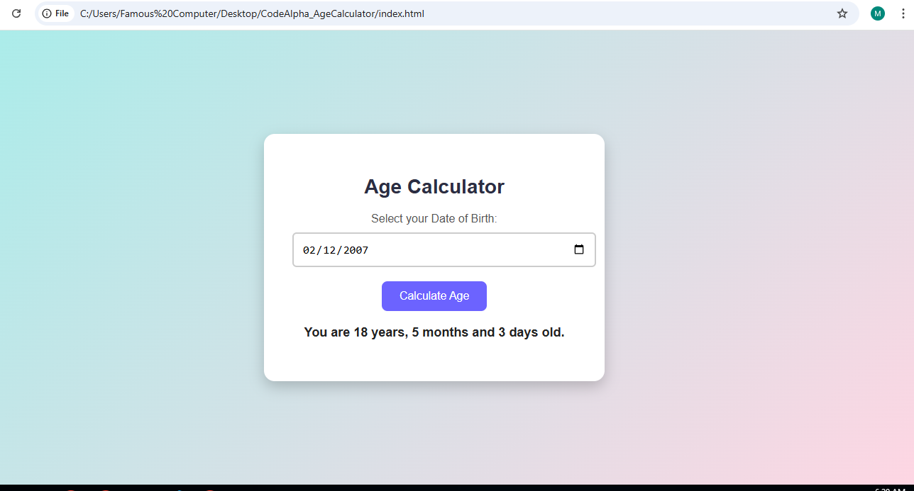

# 🎂 Age Calculator

A simple and elegant web app that calculates a person's age in **years**, **months**, and **days** based on their Date of Birth.

---

## 💻 Built With

- 🧱 HTML – Structure
- 🎨 CSS – Styling & Layout
- ⚙️ JavaScript – Logic & Age Calculation

---

## 🚀 How to Use

1. Select your Date of Birth using the calendar picker.
2. Click the **"Calculate Age"** button.
3. Your exact age will be displayed on the screen in years, months, and days.

---

## 📷 Screenshot (Optional)

> 📌 *Add a screenshot of your project here for better presentation (optional but recommended)*

---

## 🏁 Live Demo

🔗 [Click here to view the live app](https://your-username.github.io/CodeAlpha_AgeCalculator/)

---

## 📝 Internship Info

This project is submitted as part of the **Web Development Internship at [CodeAlpha](https://www.codealpha.tech/)**.

---

## 🧑‍💻 Author

- 👩‍💻 [Your Name](https://www.linkedin.com/in/your-link)

---

## ⭐️ Give a Star!

If you like this project, please give it a ⭐ on GitHub — it motivates me!
